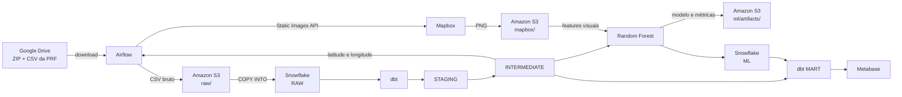

# Pipeline de acidentes da PRF com Airflow, S3, Snowflake, dbt e ML

Projeto acadêmico de engenharia de dados e inteligência artificial que ingere
dados públicos de acidentes da PRF, organiza as camadas analíticas no Snowflake,
enriquece coordenadas com imagens estáticas do Mapbox, treina um classificador de
acidentes com vítimas e publica os resultados em um dashboard Metabase.

## Arquitetura resumida

O Airflow é o orquestrador. O S3 do laboratório é efêmero; o Snowflake mantém as
camadas de dados e os resultados do modelo entre sessões.

## Componentes

| Componente | Responsabilidade |
|---|---|
| Airflow | Orquestrar ingestão, carga, imagens, treinamento e dbt |
| Amazon S3 | Armazenar CSV bruto, imagens e artefatos do modelo |
| Snowflake | Persistir dados RAW, modelos dbt, métricas e previsões |
| dbt | Tipar, testar, deduplicar e construir tabelas analíticas |
| Mapbox | Gerar imagens estáticas a partir de latitude e longitude |
| scikit-learn | Treinar o Random Forest e calcular métricas |
| Metabase | Exibir indicadores, mapa, séries e resultados do ML |

## DAGs mantidas

| DAG | Uso |
|---|---|
| `snowflake_dbt_diagnostic` | Diagnóstico opcional da autenticação Snowflake/dbt |
| `aws_lab_s3_bootstrap` | Validar a sessão AWS e criar/proteger o bucket |
| `google_drive_zip_csv_to_s3` | Baixar o ZIP, extrair e enviar o CSV ao S3 |
| `s3_to_snowflake_raw` | Carregar RAW e executar os modelos dbt de entrada |
| `snowflake_mapbox_images_to_s3` | Buscar um lote de imagens e atualizar o manifesto |
| `train_accident_severity_model` | Treinar, persistir resultados e atualizar os marts |

## Execução rápida

1. Leia os [pré-requisitos e a configuração inicial](docs/01_snowflake_dbt_setup.md).
2. Copie os arquivos de exemplo para `.env` e `.env.aws-lab`.
3. Gere e cadastre a chave RSA do Snowflake.
4. Inicie os serviços com Docker Compose.
5. Siga a [execução ponta a ponta](docs/05_execucao_ponta_a_ponta.md).
6. Configure o dashboard com o [roteiro do Metabase](docs/08_metabase_dashboard.md).

Nunca versione `.env`, `.env.aws-lab`, tokens ou chaves privadas. Os arquivos de
exemplo contêm apenas placeholders.

## Resultados do piloto validado

- 249.250 registros válidos na camada `STAGING`;
- 29.775 acidentes únicos na camada `INTERMEDIATE`;
- 7.444 previsões no conjunto de teste;
- F1 de 0,9243, recall de 0,9730 e ROC AUC de 0,7770;
- dashboard com KPIs, matriz de confusão, série temporal, mapa, distribuição por
  classificação/UF e importância das features.

O lote validado possuía somente cinco acidentes com imagem. Isso comprova a
integração técnica, mas ainda não comprova ganho preditivo causado pelas imagens.

## Documentação

O índice completo está em [docs/README.md](docs/README.md).
