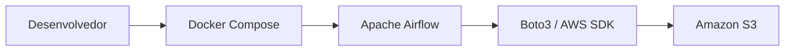

# Airflow local com Docker e integração com Amazon S3

Projeto acadêmico criado para executar o **Apache Airflow localmente com Docker Compose** e validar a integração com um bucket **Amazon S3** usando credenciais temporárias de uma conta de laboratório AWS.

Nesta etapa, o projeto contempla:

- execução local do Apache Airflow;
- configuração por variáveis de ambiente;
- autenticação na AWS dentro dos containers;
- listagem de objetos do bucket;
- envio de um arquivo de teste ao Amazon S3;
- estrutura adequada para versionamento no Git.

> O escopo atual termina na validação do upload para o S3. A criação do DAG responsável por baixar um arquivo do Google Drive e enviá-lo automaticamente será uma evolução posterior.

---

## Arquitetura



O Airflow é executado localmente em containers. As credenciais AWS são fornecidas por variáveis de ambiente e utilizadas pelo `boto3` para acessar o S3.

---

## Tecnologias utilizadas

- Docker Desktop
- Docker Compose
- Apache Airflow
- Python
- Boto3
- Amazon S3
- PostgreSQL
- Redis
- Git

---

## Pré-requisitos

Antes de iniciar, verifique se os seguintes programas estão instalados:

- Docker Desktop;
- Docker Compose;
- Git.

No Windows, recomenda-se utilizar o Docker Desktop com o backend WSL2.

Execute:

```powershell
docker --version
docker compose version
git --version
```

Também é recomendável disponibilizar pelo menos **4 GB de memória** para o Docker. Para uma execução mais confortável do ambiente completo do Airflow, 8 GB são preferíveis.

---

## Estrutura esperada do projeto

```text
airflow-seminario/
├── config/
├── dags/
├── data/
├── logs/
├── plugins/
├── .env
├── .env.example
├── .gitignore
├── docker-compose.yaml
├── Dockerfile
├── requirements.txt
└── README.md
```

Descrição dos principais diretórios:

| Diretório | Finalidade |
|---|---|
| `dags/` | DAGs desenvolvidos para o Airflow |
| `data/` | Arquivos locais utilizados pelos fluxos |
| `logs/` | Logs gerados pelo Airflow |
| `plugins/` | Plugins personalizados |
| `config/` | Configurações adicionais do Airflow |

---

## 1. Clonar o projeto

```powershell
git clone URL_DO_REPOSITORIO
cd airflow-seminario
```

Caso o projeto ainda não esteja em um repositório remoto, apenas acesse sua pasta local:

```powershell
cd C:\caminho\para\airflow-seminario
```

---

## 2. Configurar o arquivo `.env`

As configurações locais e credenciais não devem ser gravadas diretamente no código.

Crie o `.env` a partir do exemplo:

```powershell
Copy-Item .env.example .env
```

No Linux ou macOS:

```bash
cp .env.example .env
```

Exemplo de conteúdo:

```dotenv
# Airflow
AIRFLOW_UID=50000
FERNET_KEY=COLE_AQUI_A_CHAVE_FERNET

# Credenciais temporárias da AWS
AWS_ACCESS_KEY_ID=COLE_AQUI_A_ACCESS_KEY
AWS_SECRET_ACCESS_KEY=COLE_AQUI_A_SECRET_KEY
AWS_SESSION_TOKEN=COLE_AQUI_O_SESSION_TOKEN

# Região do bucket
AWS_DEFAULT_REGION=us-east-1

# Nome do bucket, sem s3:// e sem ARN
S3_BUCKET_NAME=nome-do-bucket

# Prefixo opcional para organizar os objetos
S3_PREFIX=raw/airflow
```

### Nome correto do bucket

Utilize somente o nome:

```dotenv
S3_BUCKET_NAME=meu-bucket
```

Não utilize:

```dotenv
S3_BUCKET_NAME=s3://meu-bucket
```

Nem:

```dotenv
S3_BUCKET_NAME=arn:aws:s3:::meu-bucket
```

### Credenciais temporárias do laboratório

Contas educacionais normalmente fornecem:

```dotenv
AWS_ACCESS_KEY_ID=ASIA...
AWS_SECRET_ACCESS_KEY=...
AWS_SESSION_TOKEN=...
```

O `AWS_SESSION_TOKEN` é obrigatório quando as credenciais são temporárias.

Essas credenciais expiram. Quando uma nova sessão do laboratório for iniciada, talvez seja necessário atualizar o `.env` e recriar os containers.

---

## 3. Observações sobre o laboratório

Foi utilizado o laboratório **Lab: Querying Data by Using Athena** do modulo **Module 4 Design Principles and Patterns for Data Pipelines** outros laboratórios não possuiam permissão para utilização do S3.

Após subir o laboratório as credenciais ficam dispóniveis em **AWS Details** ao lado de **Start Lab** e **End Lab**.

---

## 4. Construir a imagem

Na raiz do projeto:

```powershell
docker compose build
```

Para reconstruir completamente a imagem:

```powershell
docker compose build --no-cache
```

---

## 5. Inicializar o Airflow

Execute a inicialização do banco de dados e dos componentes básicos:

```powershell
docker compose up airflow-init
```

A inicialização estará concluída quando o serviço `airflow-init` finalizar com código de saída `0`.

---

## 6. Iniciar os containers

```powershell
docker compose up -d
```

Verifique o estado dos serviços:

```powershell
docker compose ps
```

Os principais serviços devem aparecer como iniciados ou saudáveis.

Exemplo:

```text
airflow-api-server
airflow-scheduler
airflow-dag-processor
airflow-worker
airflow-triggerer
postgres
redis
```

Os nomes podem variar conforme a versão do arquivo `docker-compose.yaml`.

---

## 7. Acessar a interface do Airflow

Abra no navegador:

```text
http://localhost:8080
```

Quando utilizadas as credenciais padrão do Docker Compose oficial:

```text
Usuário: airflow
Senha: airflow
```

Essas credenciais são adequadas somente para ambiente local e acadêmico.

---

## 8. Validar as variáveis dentro do container

Verifique a região e o bucket recebidos pelo scheduler:

```powershell
docker compose exec airflow-scheduler python -c "import os; print('Região:', os.getenv('AWS_DEFAULT_REGION')); print('Bucket:', os.getenv('S3_BUCKET_NAME'))"
```

Não imprima no terminal:

- `AWS_SECRET_ACCESS_KEY`;
- `AWS_SESSION_TOKEN`;
- demais segredos.

---

## 9. Validar a autenticação na AWS

Execute uma chamada ao AWS STS:

```powershell
docker compose exec airflow-scheduler python -c "import boto3; print(boto3.client('sts').get_caller_identity())"
```

Uma resposta válida será semelhante a:

```text
{
    'UserId': '...',
    'Account': '...',
    'Arn': 'arn:aws:sts::...'
}
```

Esse teste confirma que:

- as credenciais foram carregadas pelo container;
- o token temporário ainda está válido;
- o `boto3` conseguiu autenticar na AWS.

---

## 10. Listar objetos do bucket

Para listar até cinco objetos:

```powershell
docker compose exec airflow-scheduler python -c "import boto3, os; s3=boto3.client('s3', region_name=os.environ['AWS_DEFAULT_REGION']); resposta=s3.list_objects_v2(Bucket=os.environ['S3_BUCKET_NAME'], MaxKeys=5); print([obj['Key'] for obj in resposta.get('Contents', [])])"
```

Possíveis resultados:

```text
[]
```

O bucket está vazio ou não existem objetos visíveis para a identidade atual.

```text
['arquivo.csv', 'raw/airflow/teste.txt']
```

A conexão funcionou e os objetos foram listados.

---

## 11. Enviar um arquivo de teste ao S3

### Upload usando um prefixo

```powershell
docker compose exec airflow-scheduler python -c "import boto3, os; s3=boto3.client('s3', region_name=os.environ['AWS_DEFAULT_REGION']); s3.put_object(Bucket=os.environ['S3_BUCKET_NAME'], Key='raw/airflow/teste-conexao.txt', Body=b'Conexao do Airflow com S3 funcionando'); print('Upload realizado com sucesso')"
```

O objeto será criado como:

```text
s3://nome-do-bucket/raw/airflow/teste-conexao.txt
```

## 12. Confirmar o upload

Execute novamente a listagem:

```powershell
docker compose exec airflow-scheduler python -c "import boto3, os; s3=boto3.client('s3', region_name=os.environ['AWS_DEFAULT_REGION']); resposta=s3.list_objects_v2(Bucket=os.environ['S3_BUCKET_NAME']); print([obj['Key'] for obj in resposta.get('Contents', [])])"
```

Também é possível abrir o console da AWS:

1. acesse o serviço **S3**;
2. abra o bucket configurado;
3. atualize a página;
4. localize o arquivo enviado.

---

## 13. Enviar um arquivo local existente

Para enviar um arquivo que esteja no volume `data/`, use `upload_file`.

Exemplo de arquivo local:

```text
data/arquivo.csv
```

Dentro do container, esse arquivo deverá estar disponível como:

```text
/opt/airflow/data/arquivo.csv
```

Comando:

```powershell
docker compose exec airflow-scheduler python -c "import boto3, os; s3=boto3.client('s3', region_name=os.environ['AWS_DEFAULT_REGION']); s3.upload_file('/opt/airflow/data/arquivo.csv', os.environ['S3_BUCKET_NAME'], 'raw/airflow/arquivo.csv'); print('Arquivo enviado com sucesso')"
```

Para isso, o `docker-compose.yaml` deve possuir o volume:

```yaml
volumes:
  - ${AIRFLOW_PROJ_DIR:-.}/data:/opt/airflow/data
```

---

## 14. Parar o ambiente

Para parar os containers sem remover os dados persistidos:

```powershell
docker compose down
```

Para parar e remover também os volumes:

```powershell
docker compose down -v
```

> Atenção: `docker compose down -v` remove os volumes do PostgreSQL e reinicia o estado local do Airflow.

---

## 15. Atualizar credenciais temporárias

Quando as credenciais do laboratório expirarem:

1. inicie novamente o laboratório;
2. obtenha as novas credenciais;
3. atualize o `.env`;
4. recrie os containers.

```powershell
docker compose up -d --force-recreate
```

Para validar novamente:

```powershell
docker compose exec airflow-scheduler python -c "import boto3; print(boto3.client('sts').get_caller_identity())"
```

---

## Solução de problemas

### Aviso: `FERNET_KEY variable is not set`

Exemplo:

```text
The "FERNET_KEY" variable is not set. Defaulting to a blank string.
```

Gere uma chave Fernet, adicione-a ao `.env` e recrie os containers:

```powershell
docker compose up -d --force-recreate
```

### Erro: `ExpiredToken`

As credenciais temporárias expiraram.

Solução:

1. gere ou copie novas credenciais do laboratório;
2. atualize o `.env`;
3. recrie os containers.

### Erro: `InvalidClientTokenId`

Possíveis causas:

- credenciais copiadas incorretamente;
- token de sessão ausente;
- credenciais expiradas;
- containers ainda utilizando os valores antigos.

### Erro: `AccessDenied` em `PutObject`

A identidade autenticada não possui permissão para gravar no recurso indicado.

A autorização mínima esperada é semelhante a:

```json
{
  "Effect": "Allow",
  "Action": "s3:PutObject",
  "Resource": "arn:aws:s3:::NOME_DO_BUCKET/*"
}
```

A política precisa ser concedida pelo administrador do laboratório. Terraform, Airflow e `boto3` não conseguem contornar restrições do IAM.

### O bucket lista objetos, mas não permite upload

As permissões são separadas:

- `s3:ListBucket`: listar objetos;
- `s3:PutObject`: enviar objetos;
- `s3:GetObject`: baixar objetos.

Conseguir listar o bucket não significa que a conta também possui autorização para gravar.

### Serviço `airflow-scheduler` não encontrado

Confira os nomes dos serviços:

```powershell
docker compose ps
```

Depois substitua `airflow-scheduler` nos comandos pelo nome definido no seu `docker-compose.yaml`.

### O Airflow não abre na porta 8080

Verifique os logs:

```powershell
docker compose logs --tail=200
```

Ou somente os componentes principais:

```powershell
docker compose logs --tail=200 airflow-scheduler
docker compose logs --tail=200 airflow-api-server
```

---

## Segurança e versionamento

Nunca envie credenciais reais para o Git.

O `.gitignore` deve conter:

```gitignore
.env

data/*
!data/.gitkeep

logs/*
!logs/.gitkeep

__pycache__/
*.py[cod]

.terraform/
*.tfstate
*.tfstate.*
*.tfvars
```

O arquivo `.env.example` pode ser versionado, desde que contenha somente valores fictícios:

```dotenv
AWS_ACCESS_KEY_ID=SUBSTITUA
AWS_SECRET_ACCESS_KEY=SUBSTITUA
AWS_SESSION_TOKEN=SUBSTITUA
AWS_DEFAULT_REGION=us-east-1
S3_BUCKET_NAME=SUBSTITUA
S3_PREFIX=raw/airflow
FERNET_KEY=SUBSTITUA
```

Antes de realizar um commit:

```powershell
git status
```

Confirme que o arquivo `.env` não aparece na lista.

---

## Resultado esperado desta etapa

Ao concluir os passos, o projeto deverá ser capaz de:

1. inicializar o Apache Airflow localmente;
2. autenticar na conta AWS do laboratório;
3. acessar o bucket configurado;
4. listar objetos;
5. enviar um objeto para o Amazon S3;
6. confirmar o objeto pelo console ou pelo `boto3`.

---

## Próximas evoluções

As próximas etapas planejadas são:

1. criar um DAG no Airflow;
2. baixar um arquivo público do Google Drive;
3. validar tamanho e hash do arquivo;
4. enviar o arquivo ao Amazon S3;
5. registrar o resultado da execução nos logs;

---

## Referências oficiais

- [Apache Airflow — Running Airflow in Docker](https://airflow.apache.org/docs/apache-airflow/stable/howto/docker-compose/index.html)
- [Apache Airflow — Fernet](https://airflow.apache.org/docs/apache-airflow/stable/security/secrets/fernet.html)
- [Boto3 — Credentials](https://docs.aws.amazon.com/boto3/latest/guide/credentials.html)
- [Boto3 — Uploading files](https://docs.aws.amazon.com/boto3/latest/guide/s3-uploading-files.html)
- [AWS SDK for Python — Exemplos do Amazon S3](https://docs.aws.amazon.com/code-library/latest/ug/python_3_s3_code_examples.html)

---

## Observação

A configuração apresentada é destinada a ambiente local, acadêmico e de desenvolvimento. Para produção, são necessários controles adicionais de segurança, gerenciamento de segredos, observabilidade, alta disponibilidade e uma estratégia de implantação apropriada.


---

## Nova Estrutura

A nova DAG google_drive_zip_csv_mapbox_to_s3.py foi preparada com o fluxo completo:

```
  Google Drive
      ↓
  Download do ZIP
      ↓
  Extração do CSV
      ↓
  Upload do CSV para o S3
      ↓
  Leitura e normalização das coordenadas
      ↓
  Remoção de latitude/longitude duplicadas
      ↓
  Consulta ao Mapbox
      ↓
  Upload das imagens para o S3
      ↓
  Relatório de processamento
```

Novas variaveis de ambiente

``` 
    # -----------------------------------------------------------------
    # Mapbox
    # -----------------------------------------------------------------

    # Não coloque o token diretamente na DAG
    MAPBOX_ACCESS_TOKEN=COLE_AQUI_SEU_TOKEN

    # Estilo do mapa
    MAPBOX_STYLE=mapbox/streets-v12

    # Configurações da imagem
    MAPBOX_ZOOM=17
    MAPBOX_IMAGE_WIDTH=400
    MAPBOX_IMAGE_HEIGHT=300

    # Quantidade máxima de requisições por minuto
    MAPBOX_REQUESTS_PER_MINUTE=300

    # Quantidade máxima de imagens processadas em cada execução
    MAPBOX_MAX_IMAGES_PER_RUN=500

    # Tentativas máximas para cada coordenada
    MAPBOX_MAX_ATTEMPTS_PER_COORDINATE=3

    # Timeout da resposta da API
    MAPBOX_REQUEST_TIMEOUT_SECONDS=30

    # -----------------------------------------------------------------
    # CSV
    # -----------------------------------------------------------------

    CSV_LATITUDE_COLUMN=latitude
    CSV_LONGITUDE_COLUMN=longitude

    COORDINATE_DECIMAL_PLACES=6

    # Deixe vazio para detecção automática
    CSV_DELIMITER=;
```

Nova estrutura no S3:

```
    bucket/
    ├── raw/
    │   └── airflow/
    │       └── acidentes2026_todas_causas_tipos.csv
    │
    └── mapbox/
        ├── static-images/
        │   ├── lat_m27p084768_lon_m48p606356_a1b2c3d4e5.png
        │   └── ...
        │
        └── reports/
            └── mapbox_coordinate_processing_report.csv
```

## Evidências e Resultados

<p align="center">
  
</p>

<p align="center">
  
</p>

<p align="center">
  
</p>

<p align="center">
  
</p>

<p align="center">
  
</p>

<p align="center">
  
</p>

<p align="center">
  
</p>

<p align="center">
  
</p>

<p align="center">
  
</p>

<p align="center">
  
</p>