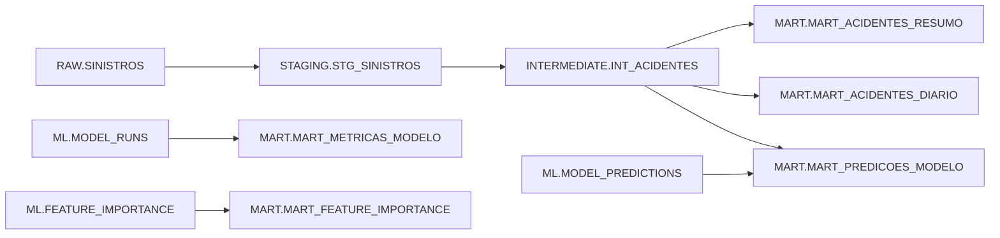

# Projeto dbt

O dbt transforma a carga textual do Snowflake em modelos tipados, testados e
adequados ao machine learning e ao Metabase.

## Linhagem



## Camadas

- `staging`: padroniza nomes, converte datas/números e remove somente a linha
  fantasma vazia do arquivo de origem;
- `intermediate`: consolida uma linha representativa por `CD_BAT` e cria o alvo
  binário `TARGET_COM_VITIMAS`;
- `marts`: publica tabelas consumidas pelo dashboard.

O macro `generate_schema_name` evita que o dbt concatene o schema do perfil ao
schema configurado no modelo.

## Comandos dentro do container

```bash
dbt debug --project-dir /opt/airflow/dbt --profiles-dir /opt/airflow/dbt
dbt build --project-dir /opt/airflow/dbt --profiles-dir /opt/airflow/dbt
```

As credenciais são obtidas exclusivamente por variáveis de ambiente e pela
chave RSA montada no container. Veja [docs/03_s3_snowflake_dbt.md](../docs/03_s3_snowflake_dbt.md).
