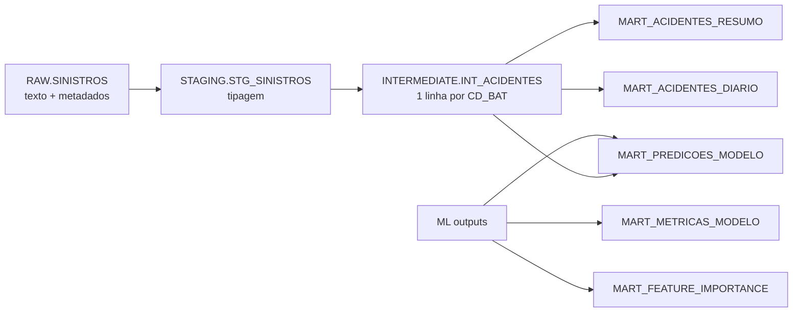

# 3. Ingestão, Snowflake e dbt

## Google Drive para S3

A DAG `google_drive_zip_csv_to_parquet_s3`:

1. baixa o arquivo público pelo ID do Google Drive;
2. confirma que o conteúdo é um ZIP válido;
3. localiza e extrai somente o CSV escolhido;
4. valida tamanho, texto, cabeçalho e hash SHA-256;
5. converte as 37 colunas para texto em Parquet com compressão Snappy;
6. valida schema, quantidade de linhas e hash do Parquet;
7. envia o Parquet a `s3://<bucket>/<S3_PREFIX>/`;
8. compara tamanho e Content-Type locais com o objeto remoto.

Os arquivos intermediários ficam em volume local ignorado pelo Git. O CSV não
é publicado no S3; ele existe somente durante a conversão.

O conversor não infere tipos analíticos: as 37 colunas são gravadas como texto,
e os valores vazio, `NA` e `N/A` viram nulos, preservando o contrato anterior da
camada RAW. A tipagem continua centralizada no dbt.

Os cabeçalhos descritivos `Sigla da Superintendência`, `Sigla da Delegacia` e
`Sigla da Unidade Operacional` são normalizados para os respectivos nomes do
contrato RAW antes da conversão.

## S3 para RAW

A DAG `s3_to_snowflake_raw` valida o objeto e executa uma carga snapshot:

1. cria um file format Parquet com tipos lógicos e scanner vetorizado;
2. cria um stage externo temporário com as credenciais da sessão AWS;
3. carrega por nome todas as colunas como texto em `RAW.SINISTROS_NEXT`;
4. valida se existem linhas;
5. publica o snapshot como `RAW.SINISTROS` por clone;
6. remove o stage temporário mesmo quando ocorre falha;
7. executa `dbt build --select +int_acidentes`, construindo staging e o modelo
   intermediario exigido pelas DAGs de imagens e treinamento;
8. valida a view `STAGING.STG_SINISTROS`.

O snapshot Parquet não materializa a quebra de linha vazia encontrada no final
do CSV. Assim, RAW e staging mantêm diretamente os 249.250 registros válidos.

## Modelos dbt



`STAGING.STG_SINISTROS` converte IDs, quantidades, data, horário, quilômetro,
latitude e longitude. `INTERMEDIATE.INT_ACIDENTES` escolhe uma linha
representativa por acidente, priorizando causa principal e menor ordem do tipo
de acidente, e cria:

- `TARGET_COM_VITIMAS`;
- hora numérica;
- indicador de fim de semana;
- região do Brasil.

Os testes dbt verificam chaves obrigatórias, unicidade, coordenadas e valores
aceitos para o alvo. O resultado validado foi 29.775 acidentes únicos.

Para executar todos os modelos manualmente dentro de um container Airflow:

```bash
dbt build --project-dir /opt/airflow/dbt --profiles-dir /opt/airflow/dbt
```
