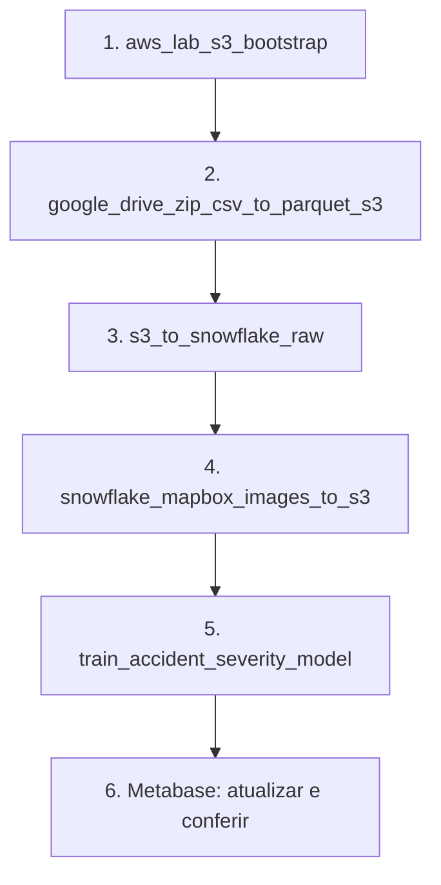

# 5. Execução ponta a ponta

Este é o roteiro operacional para uma primeira instalação e para uma nova
sessão do laboratório.

## Primeira instalação

1. Gere a chave RSA e execute o script Snowflake adequado, conforme o documento
   [01](01_snowflake_dbt_setup.md).
2. Copie `.env.example` para `.env` e preencha Snowflake, Mapbox, S3, Google
   Drive e senhas locais.
3. Copie `.env.aws-lab.example` para `.env.aws-lab` e cole somente as três
   credenciais temporárias.
4. Execute:

```powershell
Set-Location .\airflow-seminario
docker compose build
docker compose up airflow-init
docker compose up -d
docker compose ps
```

5. No Airflow, execute `snowflake_dbt_diagnostic`. As duas tasks devem ficar
   verdes.

## Ordem das DAGs



Validações esperadas:

| Etapa | Evidência mínima |
|---|---|
| Bootstrap | bucket acessível e privado |
| Drive → S3 | URI, linhas, schema, tamanhos e hashes CSV/Parquet nos logs |
| S3 → Snowflake/dbt | RAW, STAGING e `INT_ACIDENTES` preenchidos e testados |
| Imagens | objetos PNG e linhas na geração atual do manifesto |
| ML | novo `RUN_ID`, artefatos no S3 e previsões no Snowflake |
| Marts | `dbt build --select +marts` concluído sem falhas |
| Metabase | perguntas e dashboard consultando a execução mais recente |

Para ampliar as imagens, repita a quarta DAG antes do treinamento. Cada execução
processa o próximo lote ainda não registrado para o bucket atual.

## Nova sessão AWS

1. Inicie o laboratório.
2. Substitua somente as três credenciais de `.env.aws-lab`.
3. Execute `docker compose up -d --force-recreate`.
4. Recomece em `aws_lab_s3_bootstrap`.

O Parquet, as imagens e os artefatos precisam ser reconstruídos porque o S3 é
efêmero. As tabelas Snowflake podem ser substituídas por um novo snapshot.

## Encerrar o ambiente local

```powershell
docker compose down
```

Não use `docker compose down -v` se quiser preservar o histórico local do
Airflow e a configuração do Metabase.
