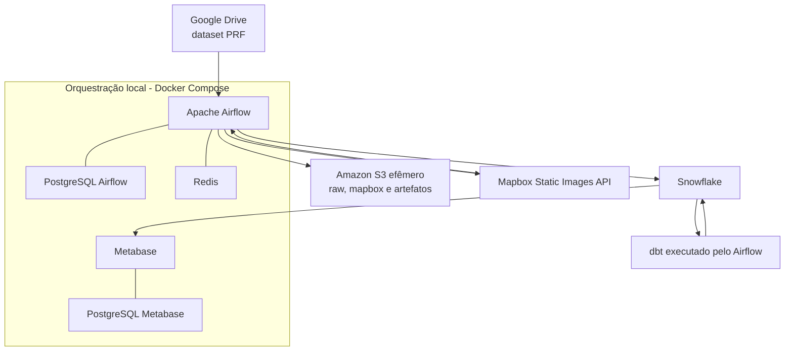
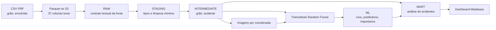
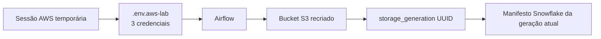

# 6. Arquitetura e fluxos

## Visão de componentes

## Fluxo lógico dos dados

O ponto crítico de modelagem é a troca de grão. O CSV possui várias pessoas ou
veículos por acidente; o modelo usa uma única linha por `CD_BAT`. Isso evita que
o mesmo acidente apareça simultaneamente em treino e teste, reduzindo vazamento
de informação.

## Fronteira efêmera

O UUID impede que metadados de um bucket anterior sejam interpretados como
imagens disponíveis no bucket novo.

## Escolhas de responsabilidade

- Airflow coordena tarefas e dependências; não é usado como motor analítico.
- Snowflake executa a carga e armazena tabelas persistentes.
- dbt concentra transformações SQL e testes de qualidade.
- Python/scikit-learn concentra preprocessing e treinamento.
- S3 armazena objetos grandes; Snowflake armazena referências e resultados.
- Metabase consulta apenas tabelas de consumo, sem duplicar regras de negócio.
